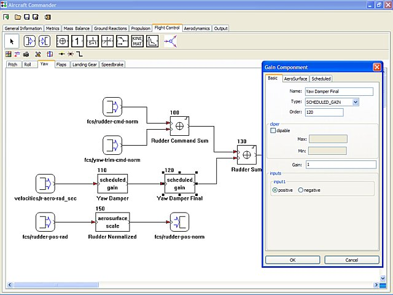
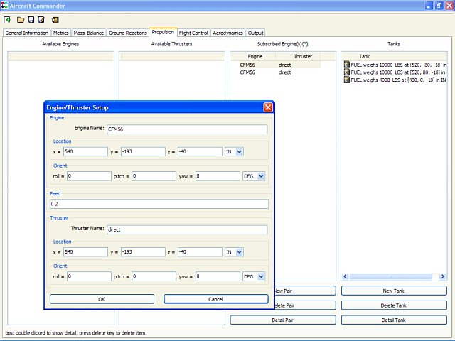
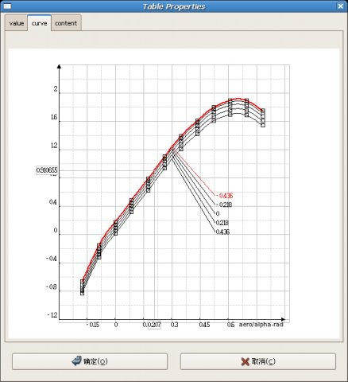

# JSBSim Commander
JSBSimCommander is a platform-independent, open source editor for creating and editing JSBSim aircraft models. Originally created by Matthew Gong, JSBSim Commander is actively under development and supported by Matthew and various members of the JSBSim development team.

The flight control system editor features a drag and drop capability for building up a set of control laws using components such as a gain, filter, summer, deadband, integrator, etc.

The propulsion devices for a vehicle can be assembled using the propulsion editor.

Tables used in modeling aerodynamic effects can be visualized using the table editor.

For more information about JSBSim, see https://github.com/JSBSim-Team/jsbsim
